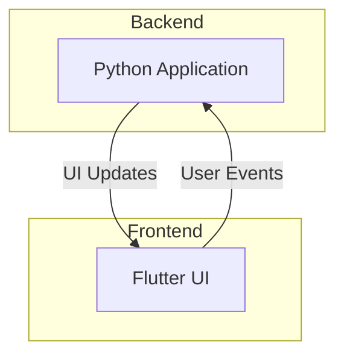
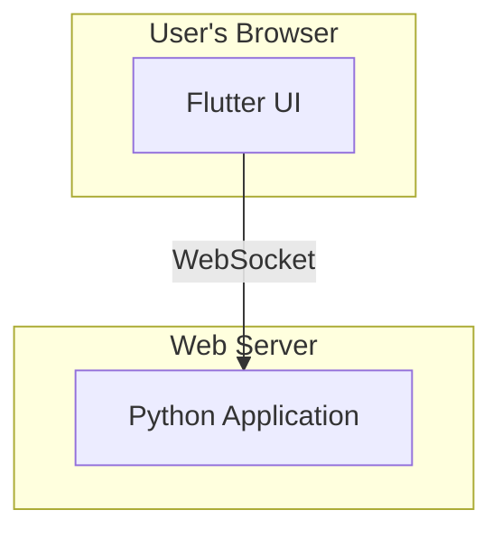
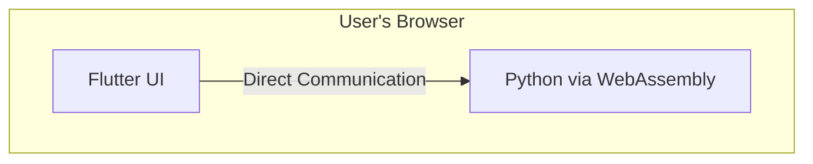

# Flet Architecture: Python, Flutter, and WebAssembly

## 1. Introduction to Flet

Flet is a framework for building real-time, multi-platform applications (web, mobile, and desktop) with Python. It allows Python developers to create interactive user interfaces without writing any frontend code in JavaScript, HTML, or CSS.

## 2. Core Architecture

Flet's architecture is composed of two main parts: a backend and a frontend.

*   **Backend:** This is where your Python application logic resides. It manages the application's state, handles user interactions, and sends UI updates to the frontend.
*   **Frontend:** The user interface is a Flutter application. It renders the UI, captures user events (like button clicks and text input), and sends them to the Python backend.

This separation of concerns allows developers to leverage the extensive ecosystem of Python libraries for their application's logic while benefiting from Flutter's high-performance, cross-platform UI toolkit.

## 3. Communication: The Flet Protocol

The backend and frontend communicate over a simple, text-based protocol using WebSockets.

1.  When a user interacts with the UI, the Flutter frontend sends a message to the Python backend.
2.  The Python backend processes the message, updates the application's state, and sends back a description of the UI changes.
3.  The Flutter frontend receives the UI description and updates the display accordingly.

## 4. Web Deployment with WebAssembly

Flet offers two primary modes for deploying web applications:

### a) Dynamic Website (Server-Side)

*   **Python Execution:** The Python code runs on a server.
*   **Communication:** The frontend (running in the user's browser) communicates with the server via WebSockets.
*   **Use Cases:** Ideal for applications that require server-side processing, access to databases, or integration with other backend services.

### b) Static Website (Client-Side with WebAssembly)

*   **Python Execution:** The Python application is packaged to run entirely in the browser using **Pyodide**, a port of Python to WebAssembly.
*   **Communication:** The communication between the Python code and the Flutter UI happens entirely within the browser, resulting in zero-latency UI updates.
*   **Use Cases:** Perfect for creating standalone, client-side applications that can be hosted on static web hosting services like GitHub Pages or Netlify.

## 5. Summary

Flet empowers Python developers to build beautiful, interactive applications for multiple platforms. Its unique architecture, which combines the power of Python with the flexibility of Flutter, and its support for WebAssembly, make it a versatile and powerful tool for a wide range of projects.
